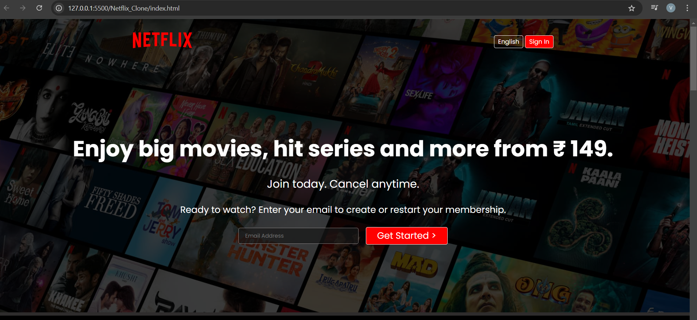

# This is Netflix Clone


# Netflix Clone

This is a simple Netflix clone created using HTML and CSS. The project replicates the basic design and layout of the Netflix homepage.

## Features
- Responsive design for various screen sizes
- Header with Netflix logo, navigation links, and a sign-in button
- Hero section with featured content and call-to-action
- Rows showcasing movie thumbnails grouped by categories
- Footer with useful links and social media icons

## Technologies Used
- **HTML5**: For structuring the web page
- **CSS3**: For styling and layout

## How to Use
1. Clone this repository to your local machine:
   ```bash
   git clone https://github.com/yourusername/netflix-clone.git
   ```
2. Navigate to the project folder:
   ```bash
   cd netflix-clone
   ```
3. Open `index.html` in your web browser to view the project.

## Project Structure
```
netflix-clone/
├── index.html    # Main HTML file
├── styles/       # Folder containing CSS files
│   └── style.css # Main stylesheet
└── assets/
│   └── netflix_clone.png
```

## Screenshots

*Screenshot of the Netflix clone homepage.*

## Contributing
Contributions are welcome! If you'd like to enhance this project, feel free to:
- Fork the repository
- Create a new branch for your feature or fix
- Submit a pull request

## License
This project is open source and available under the [MIT License](LICENSE).

---

*This project is for educational purposes only and is not affiliated with or endorsed by Netflix.*
